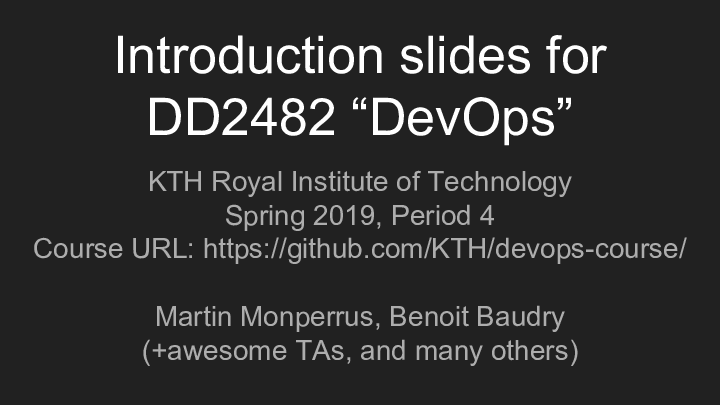

# KTH DevOps Course

This repository contains the material and content of the DevOps course at KTH Royal Institute of Technology

**When to register?**: You must register to this course between Nov 1 and Nov 15 2018.  
**How to register?**: Through the Swedish registration system <https://www.antagning.se>

Next course start: March 2019 (Period 2019-03-18 - 2019-06-04).

--Benoit Baudry, Martin Monperrus

Other URLs:
* KTH Social: <https://www.kth.se/social/course/DD2482/>
* Kopps: <https://www.kth.se/student/kurser/kurs/DD2482?l=en>

## Content

DevOps is a huge galaxy of technology and concepts. We cannot teach them all within a single course.

What are the most relevant ones in 2018? What technology should be mentioned or taught in a DevOps course? 

If you have an opinion about this, please open an issue with the tool name and purpose as issue title, together with a brief explanation of its relevance as issue body.

## Material

Books:

* [Effective DevOps : Building a Culture of Collaboration, Affinity, and Tooling at Scale (Jennifer Davis and Katherine Daniels)](https://ebookcentral-proquest-com.focus.lib.kth.se/lib/kth/detail.action?docID=4537261)
* [The DevOps Handbook (Gene Kim, Jez Humble, Patrick Debois, John Willis, and John Allspaw)](https://ebookcentral-proquest-com.focus.lib.kth.se/lib/kth/detail.action?docID=4717635)
* [Site Reliability Engineering : How Google Runs Production Systems (Betsy Beyer, Chris Jones, Jennifer Petoff, and Niall Richard Murphy)](https://ebookcentral-proquest-com.focus.lib.kth.se/lib/kth/detail.action?docID=4543978)

## Related courses

* [Devops Course at North Carolina State University, by Chris Parnin](https://github.com/CSC-DevOps/Course)
