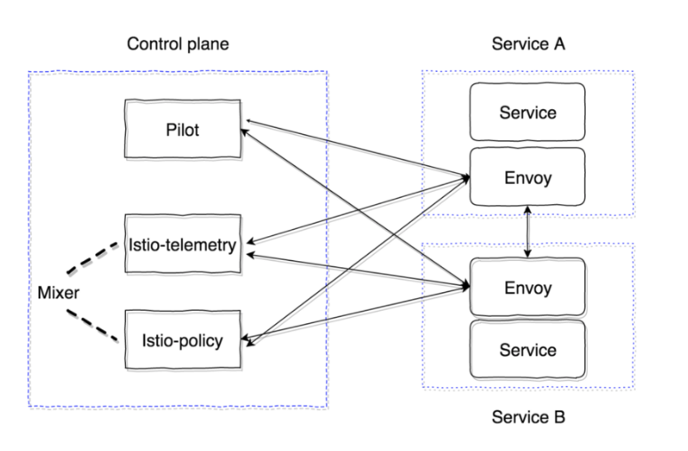

This document is the result of experimenting with  [Kubernetes](https://kubernetes.io/)
and [Istio](https://istio.io/). Whatever will be presented here is mostly an insight
on the basic concepts of *Istio*, which I acquired during my basic introduction
and experimenting. I hope it will help others with their attempt to get more
involved with this technologies. The following content is not unique or innovative on what
it presents. It's a tutorial that tries to concentrate knowledge in a single point and help
a beginner to realize basic concepts.

### Technical Prerequisites : Minikube, kubectl and Istio
For the reader to follow and replicate the tutorial will need :

* Desire to learn something new,  
* Minikube locally installed,
* as well as Istio locally installed

A general knowledge of Java, Maven and coding is needed in order to understand
the more introductory/background sections that follow.

### What is Istio?
One can easily find the answer by a Google search. Quoting from Istio's documentation pages:  

**"Istio is a service mesh that layers transparently onto existing distributed applications. It is also a platform, including APIs that let it integrate into any logging platform, or telemetry or policy system. Istio’s diverse feature set lets you successfully, and efficiently, run a distributed microservice architecture, and provides a uniform way to secure, connect, and monitor microservices."**

In my personal opinion this description does not give much to unexperienced engineers,
which have not been involved with microservices architecture and encounter the complexity of systems with this architecture.

### What problems does Istio solve?

In order to understand what problem Istio as a service mesh solves we will have first to give some historic
background on how services were developed and delivered untill few years back and how are now.

##### "Historical" Background

In the past, we had monolithic applications, usually were also large, that “did it all”. In a monolith, the user interface and the data access layer are grouped together. This is usually done via a large code repository, and both of these layers will probably depend on the other to be in place in order to run. Furthermore the user interface and data access layers typically are bundled into the same process at runtime, meaning they communicate on the same system, using system resources (memory and compute cycles) to interact with other parts of the system.
This was a way for companies to get their product to market and worked well initially, but it could not scale up and out and for that reason microservices were introduced.


Microservices are independently deployable services running within their own processes. They often communicate using HTTP resources and each service is typically responsible for a single area within the application. This approach helped distributed teams contribute to various services without having to build/test/deploy the whole application for every service change and also not have to step all over each other’s code. Deploying services to the Cloud is also easier as individual services could be auto-scaled based on need. Each service can be build in the language that is best for the problem, as we could have a Java/C++ service do more processing-intensive work and a Rails/Node.js service could be used to support front end applications and so on.
We will take as an example a set of basic microservices that reside in this [repo](https://github.com/protopapa/microservices-elk/tree/master/basic-spring-microservices).

We have three services *Gateway Service*, *Customer Service* and *Account Service*. The gateway which is a [Zuul](https://github.com/Netflix/zuul) service, serves as an edge service to the customer service, which will contact the account service to get account details.

One of the first matters that we encounter is how the services will find each other when they will be deployed on VM/Container in production. For that reason we have the *Discovery Service*, which is a [Eureka Server](https://github.com/Netflix/eureka). Each service on start, will inform the Eureka server in which IP an other service can find them. Moreover, every service is using the Logback Logstash Appender to send all logs to the pre-configured Logstash server.     

It is obvious here, that the software that implements the business logic of the potential product is tightly coupled with the infrastructure. The developer should maintain the versions of the discovery server and clients, as well as the integration with the correct Logstash server etc. This increases the configuration files needed, but mostly this implies that whenever a change is needed in the infrastructure, it will also require a re-deployment of the actual product software. Moreover, the Netflix stack that we used in this example, is not compatible with polyglot services, thus we are forced to only develop in Java and the stacks around it.

Exactly here comes Istio. Basically, it helps to create a network of services with load balancing, service discovery, tracing and monitoring without changing or introducing any extra libraries in the software that runs the business logic. Additionally, you get all the needed functionality in one product instead of maintain a set of them to achieve the same.

### How Istio works - A simplified verion

Istio is deployed in K8s, in its own cluster and with its own namespace.
It has two main components that are composed by few subcomponents

* Control Plane, which consist of:
    * Pilot provides service discovery for the Envoy sidecars, traffic management capabilities for intelligent routing
    * Citadel is used for authentication
    * Mixer is an optional control plane component that provides the ability to collect metrics, logs, and network interactions
* Data Plane, which consists of:
    * Envoy is the intelligent proxy, deployed as sidecars in every pod. This simply means that every K8s pod (which has one container with one service) will now have one more container with the Envoy proxy.



### Traffic Management with Istio.

To start with Istio, I chose to experiment with the first core feature that provides, traffic management. Traffic management is basically a set of rules that define in which services / api version the traffic will be routed. It should be mentioned that with K8s you can also do traffic management using canary deployments and direct a proportion of traffic to one version of your app in a similar manner as Istio, but Istio is way more flexible in this case by allowing you to set fine grained traffic percentages and controlling traffic using various criteria.


#### Set Up Minikube, Istio and Application

Prepare Minikube for Istio by starting it with the below command
`` minikube start --memory=8192 --cpus=4 --kubernetes-version=v1.14.0 ``. You should replace the version of Kubernetes to be similar with the one you have installed.

After downloading Istio on your machine, access the install directory and run
`` kubectl apply -f istio-demo.yaml ``. This _yaml_ file comes with the most basic setup needed of Istio. After this runs successfully, we can verify that Istio runs with the command `` kubectl get pods -n istio-system ``.
After all Istio pods are in the state of running or completed, we can proceed with the deployment of the basic application.
The application we will deploy is just a Nginx static site which has two versions.

```
kind: Deployment
metadata:
  name: myapp-v1
spec:
  replicas: 1
  template:
    metadata:
      labels:
        app: myapp
        version: v1
    spec:
      containers:
      - name: myapp
        image: janakiramm/myapp:v1
        ports:
        - containerPort: 80

apiVersion: extensions/v1beta1
kind: Deployment
metadata:
  name: myapp-v2
spec:
  replicas: 1
  template:
    metadata:
      labels:
        app: myapp
        version: v2
    spec:
      containers:
      - name: myapp
        image: janakiramm/myapp:v2
        ports:
        - containerPort: 80
```

#### What is the effect of the above ``.yaml`` file?

In the above ``yaml`` file we use the concept of *Deployment* to deploy and updating the app declaratively. The *Deployment* is a high-level resource  meant for deploying and updating application in K8s.
When a *Deployment* is created, a *ReplicaSet* is also created underneath. *ReplicaSet* is the one that creates, manages and replicates the actual pods that the application is running.
Summarizing applying the above file will create two *Deployments*, two *ReplicaSet* for every version of the application and one pod for each application version.

#### SetUp Istio Traffic Management
With the below .yaml file we can manage the traffic that each version of the application will receive according to the specified weights. Simple run
``kubectl apply -f name-of-file.yaml``  

```
apiVersion: networking.istio.io/v1alpha3
kind: Gateway
metadata:
  name: app-gateway
spec:
  selector:
    istio: ingressgateway
  servers:
  - port:
      number: 80
      name: http
      protocol: HTTP
    hosts:
    - "*"
---
apiVersion: networking.istio.io/v1alpha3
kind: DestinationRule
metadata:
  name: myapp
spec:
  host: myapp
  subsets:
  - name: v1
    labels:
      version: v1
  - name: v2
    labels:
      version: v2
---      
apiVersion: networking.istio.io/v1alpha3
kind: VirtualService
metadata:
  name: myapp
spec:
  hosts:
  - "*"
  gateways:
  - app-gateway
  http:
    - route:
      - destination:
          host: myapp
          subset: v1
        weight: 50
      - destination:
          host: myapp
          subset: v2
        weight: 50
```
#### What is the effect of the above ``.yaml`` file?
The first think that we define in the above  ``.yaml`` is a *Gateway*, which describes a load balancer operating at the edge of the mesh receiving incoming or outgoing HTTP/TCP connections. We define that we want to expose as Istio router the default one installed from applying the *istio-demo.yaml*. On the *host* part of the configuration of the *Gateway* we define which K8s services we want to serve through this gateway - we choose all.
The next think we define is a *VirtualService*. A *VirtualService* defines a set of traffic routing rules to apply when a host is addressed. Each routing rule defines matching criteria for traffic of a specific protocol. If the traffic is matched, then it is sent to a named destination service (or subset/version of it) defined in the registry.
The third and last think that we need to define is a *DestinationRule*. A *DestinationRule* defines policies that apply to traffic intended for a service after routing has occurred.  We use the concept of *Subset* where we define the two versions of the deployed application.

So now we will try to breakdown what happens when a request is made to the Istion ingressgateway.
We make the request directly to the istio-ingressgateway service. Our *“app-gateway”* is configured to intercept any requests (hosts: “\*”) and route them. The *“VirtualService”* is a link between the gateway and destination pods of any request. At the moment our *"myapp"*  virtualservice applies its rules on all requests (hosts: ”\*”), so it routes the received request to the two destination it has according to the weight we have defined.

Here is a short [Screencast](https://drive.google.com/file/d/1EXQT9T3aEqdpAwcPAtJU1Ek68TB8539M/view?usp=sharing)
### Conclusion

After applying all the above steps and we try to access our deployed applications through the ingressgateway ip and port, we will see that half of the times we see version one and half of the times version 2.
This was a very basic introduction on why Istio and in general service mesh is needed. Some very basic steps were followed in order to get introduced in one of the many concepts that Istio provides.
