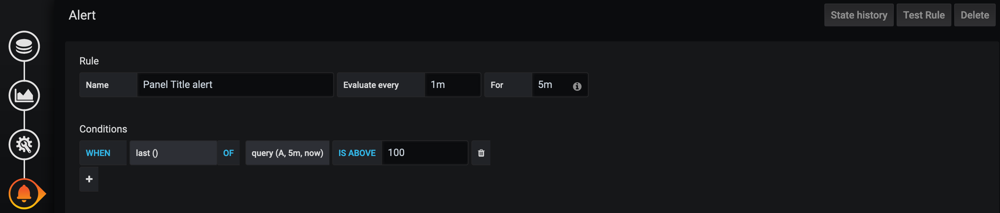

# Use the website version, it is easier to read :)

`https://blog.johvh.se/grafana/`

`https://blog.johvh.se/grafana/`

`https://blog.johvh.se/grafana/`

`https://blog.johvh.se/grafana/`

---

# Using Grafana with Python and PostgreSQL

        *Example grafana dashboard.*

A crucial part of DevOps is the continuous monitoring of your application to make sure it functions correctly. In this tutorial, we will, therefore, explore an open-source software used for this task called Grafana. The software allows us to visualise, explore and alert on data from many different databases and cloud services. 

The tutorial will be divided into four different steps which can be seen in the table of contents below. However, to visualise anything we need to provide Grafana with data. Subsequently, we will also explore how to integrate Grafana with a simple Python program using a PostgreSQL database.

**Table of contents**

1. Install Grafana
2. Install PostgreSQL
3. Setup a simple program that interacts with the database
4. Visualise data with Grafana
5. Alerts in Grafana
6. Conclusion

**Prerequisites**

For this tutorial, you will need root privileges to a server or computer running Ubuntu (18.04.3). I will be using a server hosted on DigitalOcean, to set one up you can follow their excellent [tutorial](https://www.digitalocean.com/docs/droplets/how-to/create/). Be aware that DigitalOcean hosting costs money and your credit card will be charged. However, if you are a student you can get $50 free credits via the [Github student pack](https://education.github.com/pack).

Once you have your Ubuntu server running and can connect to it via SSH, it is time to install Grafana.

**Grafana installation**

The first step is to update and install the newest packages for Ubuntu. 

```bash
sudo apt-get update
sudo apt-get upgrade
```


Next, we can install Grafana with the following commands:

```bash
sudo apt-get install -y adduser libfontconfig1
wget https://dl.grafana.com/oss/release/grafana_6.7.1_amd64.deb
sudo dpkg -i grafana_6.7.1_amd64.deb
```

Start the service and verify that it was successful. By default, Grafana will run under port 3000.

```bash
sudo systemctl daemon-reload
sudo systemctl start grafana-server
sudo systemctl status grafana-server
```

After running the status command you should get a similar output as below which indicates that Grafana is up and running.


It is often useful to allow Grafana to start on boot. To enable this we can type:

```bash
sudo systemctl enable grafana-server.service
```

Lastly, to make sure everything is working correctly we can also try to ping Grafana with the following command `ping -p 3000 localhost` and check that we get a response.

Grafana is now up and running we should be able to access it from the outside by connecting to `server_ip:3000` in the web browser. When connecting to this address we should be prompted to log in to Grafana. 


The username and password is `admin`. After logging in we are prompted to create a new password. 

Congratulations, we have now successfully installed and logged into the Grafana interface! Next, we will explore the basic Grafana workflow.

**Grafana workflow**

As you can see in the image below we have now installed Grafana. However, to visualise anything we need to have data to work with. 


We have to give Grafana access to some data source which can be a database or some form of cloud service. By clicking the "add data source" button we are shown different data sources that we can choose from such as Prometheus, Loki, Stackdriver etc. For this tutorial, we will be using a simple PostgreSQL database as our data source.

Next, we will create out data source by setting up a simple PostgreSQL database and create a program that updates this database. 

**PostgreSQL installation**

If you have previous experience with databases it should be very easy to follow along the next section. However, if you are not, I recommend you to get familiar with databases and SQL before continuing.  

Install PostgreSQL:

```bash
sudo apt update
sudo apt install postgresql postgresql-contrib
```

It is as easy as that! Now that the software is installed we can interact with the database management system by switching over to the postgres account and then typing psql. It is good practice to change the password for postgres. This will also allow us to connect to the database from another program in later sections.

```bash
sudo -i -u postgres
psql
\password postgres
```

We can now create a new database and connect to it:

```bash
CREATE DATABASE tutorial;
\c tutorial;
```

Inside the database, we will create a basic table that will be sufficient for this tutorial. In PostgreSQL the syntax for creating a new table is the following:

```sql
CREATE TABLE table_name (
    column_name1 col_type (field_length) column_constraints,
    column_name2 col_type (field_length),
    column_name3 col_type (field_length)
);
```

To keep things simple we will create a table called `grafana` with an ID, a number and a datetime. 

```sql
CREATE TABLE grafana (
    id serial PRIMARY KEY,
    number integer NOT NULL,
    date timestamp NOT NULL DEFAULT CURRENT_TIMESTAMP
);
```

To show created databases and tables we can type:

```sql
\l

and

\dt
```

The database user that Grafana will have access to should only be granted SELECT permission. Grafana does not validate or check any queries and will, therefore, execute queries such as `DROP TABLE`. This means that anyone access to an admin Grafana account could greatly harm the database. Subsequently, we need to create a read-only user in our database that Grafana will use:

```sql
CREATE USER devopsduck WITH PASSWORD 'password';
GRANT CONNECT ON DATABASE tutorial TO devopsduck;
GRANT USAGE ON SCHEMA public TO devopsduck;
GRANT SELECT ON ALL TABLES IN SCHEMA public TO devopsduck;
```

We have now created a database, a user for Grafana and a single table. We can exit the prompt by typing "\q;". Next, we will create a program that will interact with the database.

**Creating a simple example program**

For simplicity sake, the program will be written in Python (3.6.8). If you are using DigitalOcean Python will be installed automatically on Ubuntu. If not, you might have to install Python, I recommend this [tutorial](https://phoenixnap.com/kb/how-to-install-python-3-ubuntu). 

Since we are still using the postgres user, type exit to switch back to root:

```bash
exit
```

To connect to the database we need to install a database adapter that will handle the connection for us:

```bash
sudo apt-get install python3-psycopg2
```

The following code snippet contains the program that will access the database. Create a new python file and place the contents inside. However, first let's go through each important part.

```Python
import psycopg2
import time
import random

if __name__ == "__main__":
    connection = None
    try:
        connection = psycopg2.connect(user = "postgres",
                                    password = "your_password",
                                    host = "127.0.0.1",
                                    port = "5432",
                                    database = "tutorial")

        cursor = connection.cursor()
        # Print PostgreSQL Connection properties
        print ( connection.get_dsn_parameters(),"\n")

        # Print PostgreSQL version
        cursor.execute("SELECT version();")
        record = cursor.fetchone()
        print("You are connected to - ", record,"\n")

        while (True):
            cursor.execute("INSERT INTO grafana (number) VALUES(%s)", (random.randint(10, 150),))
            print('Inserting into database ...')
            connection.commit()
            time.sleep(30)

    except (Exception, psycopg2.Error) as error :
        print ("Error while connecting to PostgreSQL", error)
    finally:
        #closing database connection.
            if(connection):
                cursor.close()
                connection.close()
                print("PostgreSQL connection is closed")
```

First, we try to connect to the database. You will have to change the password to the one you created for `postgres`. Note that we do not use the `devopsduck` user here since we want to do more than just read from the database.

```python
connection = psycopg2.connect(user = "postgres",
                                    password = "your_password",
                                    host = "127.0.0.1",
                                    port = "5432",
                                    database = "tutorial")
```

Next is the most important code. Here the program executes an insert query to the database. The code will insert a random value between 10 and 150 into the number column in the table called `grafana`. Lastly, it will sleep for 30 seconds which essentially means that the program will insert into the database every 30s.

```python
while (True):
    cursor.execute("INSERT INTO grafana (number) VALUES(%s)", (random.randint(10, 150),))
    print('Inserting into database ...')
    connection.commit()
    time.sleep(30)
```

The rest of the code contains error handling, if something were to go wrong, the connection will be closed. 

We can now run the program by typing `python3 file_name.py`. If everything went successfully we should see `Inserting into database ...` printed in the console every 30 seconds.

To make sure that the program is inserting into the database we can also connect to the database again and perform a `SELECT` query.

```bash
sudo -i -u postgres
psql tutorial
SELECT * FROM grafana;
\q
exit
```

If everything is working correctly you should see a few entries in the table.


Awesome, we have finally created all the necessary components and can begin to visualise our data in Grafana.

**Visualising data in Grafana**

Open up the Grafana interface by heading to `your_server_ip:3000` in your web browser and logging in. Click the add data source button and locate the PostgreSQL option. Now enter the database settings so that Grafana can connect to it. It is important to change the SSL mode as your server might not utilise it. The `require` option worked for me.


Click `Save & Test`, and wait for Grafana to connect the database.


Go back to the home screen and click the new Dashboard option. In Grafana we work with Dashboard and Panels. A dashboard is the canvas we work with and panels are the graphs or tables that we populate the canvas with. This allows us to have dashboards visualising different parts of the program instead of having a single giant one. Let's go through the most important buttons on the dashboard.


1. Create a new panel
2. Save current dashboard
3. Edit dashboard
4. Select how often the dashboard should update
5. Edit current panel

Click on `Add query` (5) to create our first visualisation. We are now presented with a preview of the graph we are constructing as well as options for generating a query. This query will be executed on the selected data source. Additionally, there is a toolbar on the left-hand side with four buttons. The first button is where we decide what data to query and the second how to visualise it. In the visualisation tab, we can change the properties of the graph, such as colour. On the third button, we can change panel settings such as the title and description. Lastly, there are options for setting alerts if certain events occur. 

First, we should decide what data to query. Select our PostgreSQL database as the query source and fill in the following options:


The table we want to query from is `grafana`. The time column will be the X-axis of the graph, in our case we want the `date` column along this axis. The select parameter will be the graph's y-axis, here we use the `number` column in the table. You should now be able to see a graph with some values.


If we now start the Python program we created earlier and hit the refresh button in the top right-hand corner, the graph should update with more values! As long as the Python application is running, additional values will be added.


Click the third button in the toolbar and change the title of the program. When done, remember to save the dashboard in the top right corner. 

New panels can be added and later moved by dragging and dropping on the dashboard. We have now looked at the line graph but there are a few different panel types under the visualisation tab in the panel options. 


These panels can visualise many different types of data, even tables. For example, below is an example dashboard I created. It contains a gauge, showing the latest number added to the database, indicating green if below a certain value, otherwise red. Furthermore, there is a text box written in markdown describing the dashboard. Lastly, there is a panel showing the total number of entries in the `grafana` table as well as the line-graph we created previously.


**Alerts**

Alerts are useful since they can, for example, notify us if a server is running out of resources or if our software is receiving an unusual number of requests over a certain period of time. To set up an alert, edit a panel and click the bell icon on the toolbar on the left-hand side. 



In the settings we can configure how often the condition that determines the alert should be checked and for how long the condition should be met before notifying. In the above example, Grafana will check the condition every minute and if the condition is met for 5 minutes, the selected user will be alerted. 

We can also configure the condition with a wide range of functions such as average, min and percentage difference. In the picture above the condition is met if the last value is above 100.


When an alert has been added it will colour the graph when the condition is met.

**Conclusion**

Grafana is an easy to use tool for visualisation and analytics of data. Thanks to a clean UI it is quick to get going and create your own dashboards with great-looking results. Another benefit is that it supports many different data sources which makes it applicable to almost any software out there. The many different types of panels also allow the user to visualise nearly any type of data without much hassle. 

Lastly, if you do not feel like or have any time to experiment with dashboards and panels there is a community library where people can [share their dashboards](https://grafana.com/grafana/dashboards?orderBy=name&direction=asc).

