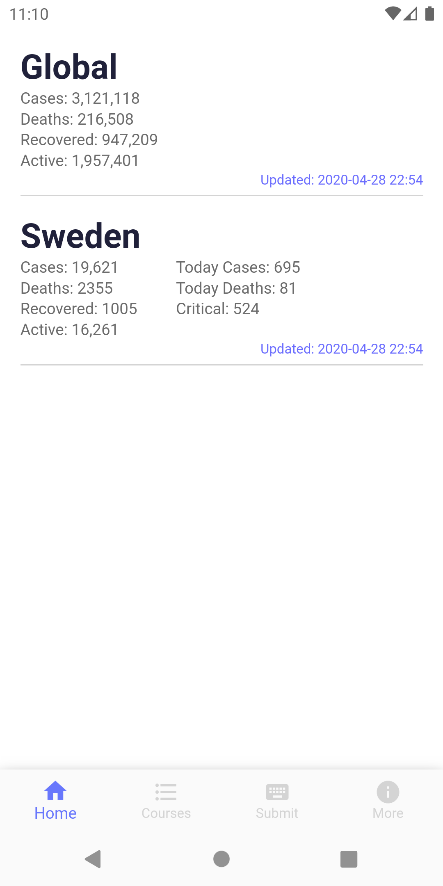
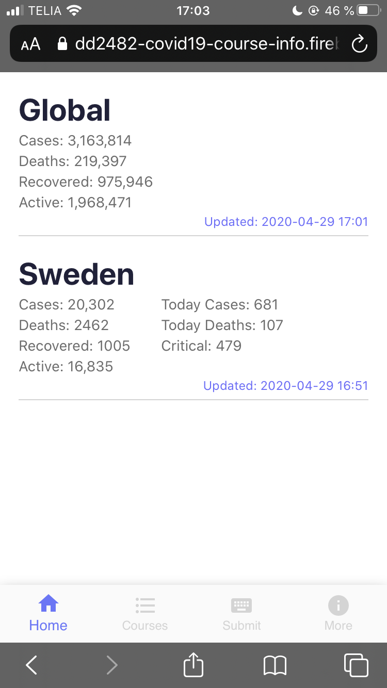
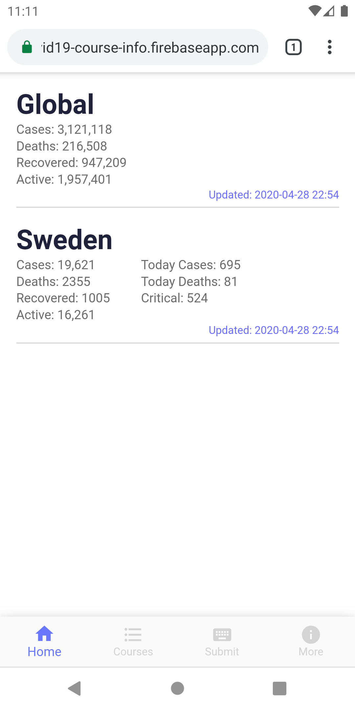
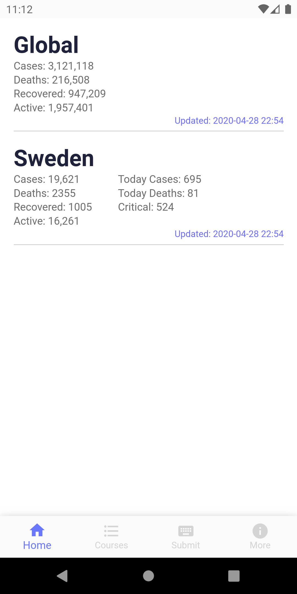

# COVID-19 KTH Course Info
A project by Johanna Iivanainen (jii@kth.se) and Tommy Samuelsson (tommysam@kth.se) for the course Automated Software Testing and DevOps DD2482.

The GitHub repository for the project COVID-19 KTH Course Info is available here: https://github.com/Zodbigt/dd2482_covid19_course_info

## Table of contents
1. [Background](#back)
    
2. [The Application](#app)

    2.1 [Functionality](#func)
    
    2.2 [DevOps Tools](#dev)
    
3. [Criteria for COVID19 Assignment](#crit)
    
[References](#ref)

<a name="back"> </a>

## Background
During the last couple of weeks, we have felt that most of the students at KTH struggle a little bit with the school right now, and feel that they don't really have control over their studies. One of the reasons is that the structure or the examination of the course may have changed due to the pandemic caused by COVID-19. Therefore, we wanted to create an app where KTH students could fill in how the courses have changed, and what type of examination they have now. By doing so, the students help each other stay updated with the course and its examinations.

<a name="app"> </a>

## The Application

The construction of the application COVID19 KTH Course Info is built by React and Firebase. React is a javascript framework created by Facebook, and Firebase is a web and mobile development platform created by Google. The application was developed to work primarily as an mobile app, but you can use it in your computer's web browser as well. Click on the [link](https://dd2482-covid19-course-info.firebaseapp.com) to see the mobile application COVID19 KTH Course Info in the web browser.

<a name="func"> </a>

### Functionality

#### COVID-19 Statistics
If you visit the [URL](https://dd2482-covid19-course-info.firebaseapp.com) for the application, you will enter the ``Home`` screen for the app. At the home screen, you will see the current numbers and statistics for the virus COVID-19, both in Sweden and in the rest of the world. The application fetch the COVID-19 data from the [NovelCOVID](https://github.com/novelcovid/api) API, so the numbers might be a little bit different compared to numbers on the [Public Health Agency of Sweden](https://www.folkhalsomyndigheten.se/smittskydd-beredskap/utbrott/aktuella-utbrott/covid-19/bekraftade-fall-i-sverige/) web page. The COVID-19 numbers that are used in NovelCOVID's API are from the [Worldometer](https://www.worldometers.info/coronavirus/).

If you want to see the current numbers for another country, you can add the country to the start page by clicking on the ``More`` symbol at the bottom of the screen and then ``Add countries``. In ``Add countries``, you can search for another country and then add their current COVID-19 data to the home screen of the application. 

#### KTH Courses
If you click on the button ``Courses`` at the bottom of the screen, you will get a list of some of the courses at KTH. Each course object contains the course code, the name of the course and how the course will be examined now due to the COVID-19. If you click on one of the courses, you will also get some more information about the picked course. If you want to update the information for the picked course, you can click on the ``three dots`` in the right corner at the top of the screen. 

The courses that we currently have in our app is added by ourselves through the submit function that we have in the application. The idea about the course list is that students can contribute with information as much as they want. So we are not fetching any data about the courses right now. Instead, we want students to add their own courses, and all the necessary changes related to them since KTH closed.

If you want to submit a new course, click on the ``Submit`` button at the bottom of the screen. We have added some restrictions on how the new course submission should be structured:
* Course code should be 6 characters long and start with two letters
* You need to add some information about how the course is examined
* The course information cannot be longer than 60 characters.

If you don't fulfill these criteria, you will receive an error message with the information you need to add or change to be able to successfully make a submission.

<a name="dev"> </a>

### Devops Tools

#### Jenkins 
One of the intended learning outcomes for the course Automated Software Testing and DevOps DD2482, is that the student should be able to setup and deploy continuous integration. Therefore, we decided to try to create our own Jenkins server and integrate it with our COVID-19 project. 

We are running Jenkins as Docker container from the Blue Ocean Docker image. We have used Jenkins' own documentation for using Jenkins with React and Node Package Manager (npm). If you want to create your own Jenkins machine and run it as a container from the Jenkins Blue Ocean image, we strongly recommend Jenkins own documentation available [here](http://www.jenkins.io/doc/tutorials/build-a-node-js-and-react-app-with-npm/).

We have created two different pipelines. One is the main pipeline that are connected to the original GitHub repository for our project. The other one is a pipeline connected to the a forked copy of the original repository, which we use to test changes in the set up of the pipeline, or when we try to build new stages for the original pipeline.

Right now, we only have a Build stage in our main pipeline. Our Build stage install all necessary dependencies and package for our React application. If we continue to work with this project after the course has ended, we also want to create a Test stage and a Deliver stage. We have tried to fix a Deliver stage in the pipeline for our forked repository, but with no further success. If there are someone who has previous knowledge or experience with creating Jenkins' pipelines for a React/NodeJS application, we would like some help with our issue [#528](https://github.com/KTH/devops-course/issues/528).

Today, our Jenkins server is running locally on Johanna's computer. To get access to our Jenkins server, you need to go to [92.34.7.239:8080](92.34.7.239:8080) and use the account `test_user` that we have created for this project. Please contact one of us for the credentials.

The server might not be up and running all the time, but down below we have a screencast of our Jenkins server in action. If the server is not up and running and you want to test our pipeline, please contact Johanna at jii@kth.se.

Click on the image below to be re-directed to the screencast at Youtube:

[](https://youtu.be/TLqDoI6_AWE) 

The video has been cut at some points to shorten the length of the video and remove parts that does not add any new information to the filmed screencast. The music that we have used in this video is provided by https://www.bensound.com.

#### Firebase
Firebase is a serverless computing service, which provides a suite of API's desiged to help deploy an application with the power of Google servers. This project uses Firebase's real time database and webhosting API’s. 
The real time database is a NoSQL document database, which gives it some limits in terms of doing custom queries to create views. Instead, the database in Firebas has its focus on simplicity and speed. 

The setup is very straight forward. 
* Install npm package with `npm install --save firebase`
* Initiate it in your code with `firebase.initializeApp(CONFIG_FIREBASE)`. The `CONFIG_FIREBASE` is just a const with your projects API key.
* Then subscribe to the desired document path of your database. 
    ```js
    dataBaseListner() {
        let ref = firebase.database().ref("kth/courses");
        ref.orderByValue().on("value", data => {
            this.setState({ data: data, loading: false });
        });
    }
    ```

      
    Example of document path. 
  
Firebase allows for instant changes with its websocket communication.

To change something in the database use commands like `push`, `update` and `delete`.
```js
    let ref = firebase.database().ref("kth/courses/");
    ref.push({
        courseCode: courseCode,
        courseName: courseName,
        courseExamination: courseExamination,
        courseInfo: courseInfo,
        courseUpdated: date,
    });
```
A conventional server setup also have security so it's not possible to cause any harm.
In Firebase this is done by setting up security rules, by assigning read and write permissions for each node that is desired to be protected.

The security rules can be edited in the online admin portals with a “test playground”. Allowing for testing different scenarios. 


So the complexity of safe security is handled in the end by Firebase/Google. It is also possible to tie the security rules to accounts for example, but the idea of this app is to have an open community. So editing courses for now is allowed by anyone. 

The other tool we use is the hosting API. Which allows to upload a build web page for fast deployment. 
This is done by installing the Firebase CL. (This is a global tool allowing for interaction with Firebase.)
Then simply run then `firebase deploy` command on the desired directory.

Serverless computing is relevant for DevOps, since it shortens the release cycle. By using a serverless architecture, the developers can focus on the functionality of the application and the application's GUI, instead of writing scripts for the server or the database. [[1]](https://en.wikipedia.org/wiki/Firebase) 


## Deployment method
To make it possible to have a safe reliable deployment, Google Play Store and Apple App Store are common dominant tools to distribute applications. It is two safe gardens that mostly work very well. However, a known problem with them is that if something critical needs to be updated or changed with the application, it could take days for an approval from Google or Apple, which leaves the application in a potentially vulnerable state. Another problem is that users tend to not always update applications, forcing developers to support multiple versions.

This project instead relies on PWA (progressive web apps) technologies. This means that the entire application resides in a web page. Drawbacks with PWA is that they are not as fast as their native siblings. However, for a small application like this one, it is hard to notice any difference at all, if all PWA guidelines are followed correctly. Since the application is a web page, it can easily be deployed to every user without the issue of needing to support multiple versions. 

A benefit with using Google Play Store and Apple App Store, is that it is a great way to distribute the application. This application however does miss out on that. Both Google and Apple provide their API for a web view. What this means is that a web page can live inside a container of both the Google app and the Apple app, pretending to be a native app. Then be uploaded to respective stores. In this case, Google and Apple only need to approve once. After that, you can simply update the web page when deploying new versions of the mobile application. The deployment can be done really fast thanks to the Firebase hosting tool used in this project.

This usually leads to bad apps that feel more like web pages. However, since this project makes use of PWA, the illusion of a native application is almost perfect.

Here are some example screens of the app in different environments: 

   

The first one is inside an Android app.  
The second one is inside an Apple app.    
The third one is the web app installed from the page it self.  
The fourth one is the app on the webb. 
 
<a name="crit"> </a>

### Criteria for COVID19 Assignment

We aim to achieve at least these criteria:

**The contribution is related to COVID-19**
* A mobile and web application that helps KTH students stay updated on changes in examination due to COVID-19.

**The contribution is related to / built with DevOps technology**
* We have created our own Jenkins server, and built a small pipeline that is connected to our repository for the application. We are also using Firebase in this project, which is a serverless computing service. Also using PWA(progressive web apps) for faster and simplified deployment.

**The contribution is novel**
* We haven't found any application that is similar to ours yet. 

**The contribution is helpful**
* If the app uses properly, it is a good way for the KTH students to get an overview on how the courses has changed due to COVID19 and how the examination will take form. The examiners might use different channels to spread the information, and as a student it might be difficult to find that information because of that. By using this application, we can gather all information at one place and update the application as soon as something has changed. 
There a lot of courses at KTH, and some of them might have found a good solution to examine a course that usually has an exam that takes place in school. This application could also be used for examinars to see how other courses are handling the situation at get some inspiration.

**The contribution attracts support from other KTH students**
* We are going to ask a couple of students from KTH to contribute to the project by give us feedback about the app. For instance, if they could consider to use it if more students contributed and updated the courses' information. At the same time, we will ask them if they could add course information to the appliction about some of their own courses. After we have received their feedback, we will discuss their comments. If the majority thinks that the application is useful and necessary, we will post it on our personal LinkedIn. We have also talked about create an issue in the KTH DevOps repository, where we ask the other students to contribute to our project if they want to. 

<a name="ref"> </a> 

### References

[1] https://en.wikipedia.org/wiki/Firebase


