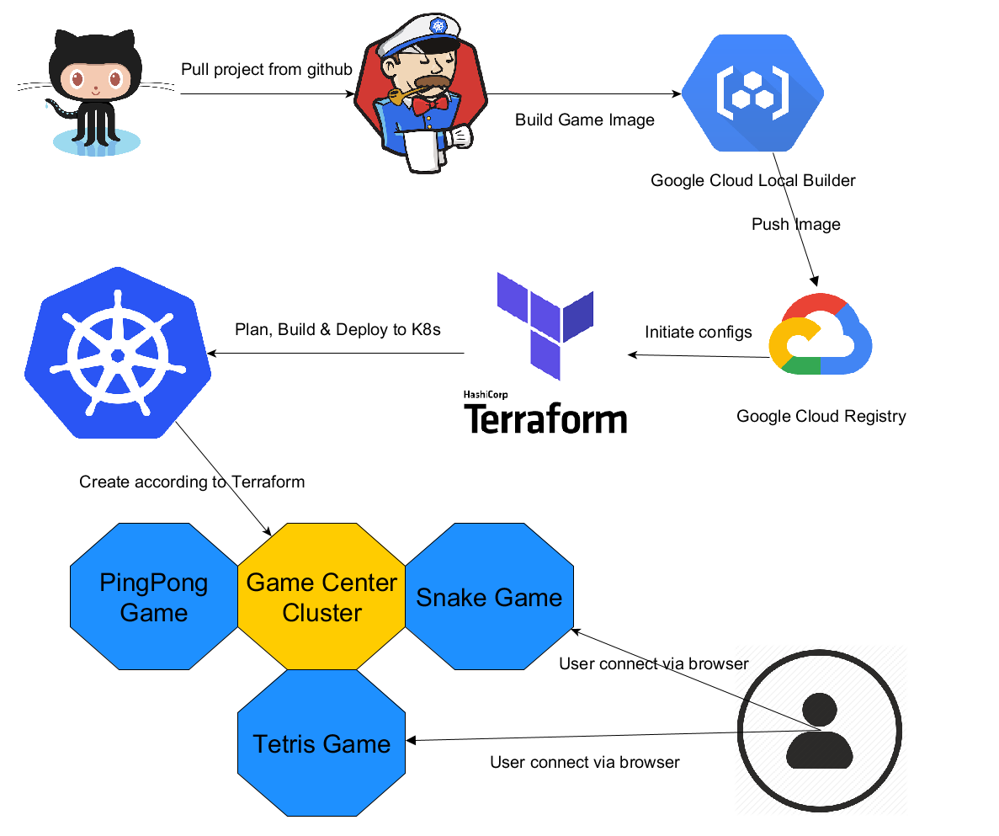

## Demo proposal

Demoers: Henry Luong(talip@kth.se) and Kartik Kandavel Mudaliar(mudaliar@kth.se)

Topic: Infrastructure as code with Terraform to continous deploy to Kubernetes

Description: For this demo we would like to demonstrate Terraform together with Jenkins and Kubernetes to Deploy our apps in [this repo](https://github.com/Tailp/DemoTerraForm) to construct a cluster called Game Center for other to connect and play any game we have deployed. For more details please watch the screencast below.

Screencast: Check youtube [Link](https://www.youtube.com/watch?v=RammN2_mpNo&feature=youtu.be)

