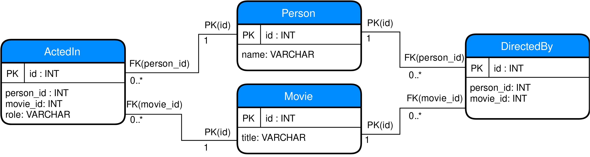

\pagenumbering{gobble}
\clearpage

\pagenumbering{roman}
\tableofcontents

\clearpage
\pagenumbering{arabic}

# Introduction
For decades, the word database has been more or less synonymous with
relational database, which in turn is more or less synonymous with SQL
database. There is no denying that SQL database systems are both performant and
reliable, and have served many purposes very well. However, using a single
technology to tackle all storage-related problems fundamentally contradicts a
simple intuition about software engineering: there is no one size fits all
solution. This article presents an introduction to graph databases, which is a
different take on data storage that does not build on the relational model.
Readers are expected to at least have a cursory understanding of SQL and the
relational model, as these will be used for comparison without being explained
in detail. The meat of the article is a theoretical presentation of two common
graph database models, as well as a by-example usage comparison of the Neo4j
graph database system with the PostgreSQL relational database system. After
having read this article, a reader with some previous experience of using SQL
databases should walk away away with some rudimentary knowledge of when it may
be appropriate to use a graph database instead, and how to get started doing
so.

# Background
Most real world applications need persistent data storage, and for a long time,
the relational database model has been the go-to for most such data stores
[@vicknair2010comparison]. The 1970s saw the inception of the _Standard Query
Language_ (SQL), as well as seminal work on performance optimizations that paved
the way for relational databases in the world outside of academia
[@selinger1979access]. Adoption rose sharply in the 1980s and SQL-based
databases has since been the de-facto standard. In the past few years, there has
been an increase in interest for non-relational database systems, collectively
known as NoSQL [@vicknair2010comparison]. It is important to note that NoSQL is
not _one_ technology, but rather denotes a collection of storage technologies
that are not based on the relational database model. Graph databases form a
subset of the NoSQL technologies [@buerli2012current]. The concept of graph
databases has been around since the 1980s, but was more or less forgotten about
in the mid 1990s due to the emergence of other new technologies, such as XML. It
is not until recently that graph databases have seen a resurgence in popularity.
Much due to this fact, the field is still in flux, and there are many different
types of graph database models around. Angles et al. provides a fairly
comprehensive but slightly dated overview of several different models and their
origins [@angles2008survey]. As there is such a large amount of different graph
database models, this article will not cover all of them.  Rather, I will
introduce the _property graph_ database, and show by practical example how using
such a database compares to the use of a traditional SQL database. I will also
present the concepts of a different kind of graph database based on the RDF
standards, as such databases frequently appeared during background research of
the subject
[@hartig2014reconciliation;@angles2018g]. The point of including some theory on
RDF graph databases is mostly to show that just as NoSQL is not one technology,
graph databases is not one technology. The focus of the rest of the article is
on property graphs. Note also that in this article, the term graph database is
used interchangeably with property graph database, and any other type of graph
database is referred to by a different name. The rest of the article is
structured as follows. [Section @sec:rdf] presents the concepts behind RDF
databases, while [Sec. @sec:pg] does the same for property graph databases.
[Section @sec:performance] makes a brief detour into the complicated area of
performance measurements. [Section @sec:usage] compares creation and subsequent
querying of a movie database using the relational PostgreSQL system, and the
property graph Neo4j system. Finally, [Section @sec:discussion] presents a
discussion of the potential pros and cons of using a graph database over a
relational database.

## Resource Description Framework (RDF) databases {#sec:rdf}
The _Resource Description Framework_ (RDF) is a set of specifications for
expressing metadata for websites, and is a key part of the WWW Consortium's
(W3C) effort to standardize a Semantic Web that a machine can not only
navigate, but also understand [@rdf;@semanticweb]. Lately, it has also seen use
as general purpose data storage in several products, including
AllegroGraph[^allegro] and GraphDB[^graphdb]. An RDF graph is a set of triples
of _subject_, _predicate_ and _object_. The subject is that which we want to
say something about, the predicate is what kind of statement we are making, and
the object the value of that statement.  For example, the triples in
[Table @tbl:rdf-example] is an RDF-like encoding of the data "The Town is a
movie", "Ben is a person", "Ben acted in The Town", and "The Town was directed
by Ben".

[^allegro]: [https://franz.com/agraph/allegrograph/](https://franz.com/agraph/allegrograph/)
[^graphdb]: [http://graphdb.ontotext.com/](http://graphdb.ontotext.com/)

Table: RDF triples example. {#tbl:rdf-example}

| Subject  | Predicate  | Object   |
| ------   | --------   | -----    |
| The Town | type       | Movie    |
| Ben      | type       | Person   |
| Ben      | actedIn    | The Town |
| The Town | directedBy | Ben      |

There is an interesting observation to be made regarding the triples presented
in [Table @tbl:rdf-example]: it is not immediately apparent that they
constitute a graph. In fact, it is possible to have for example the object of
one triple be the predicate of another, so the triples do not by themselves 
represent a graph in the traditional sense [@hayes2004bipartite]. In the
case of [Table @tbl:rdf-example] however, viewing the set union of subjects
and objects as nodes, and the set of predicates as labeled edges, it is clear
that the triples of [Table @tbl:rdf-example] induce the graph in
[Fig. @fig:rdf-example].

![Visualisation of [Table @tbl:rdf-example]](images/rdf-example.png){#fig:rdf-example width=60%}

Another interesting observation is that [Table @tbl:rdf-example] looks
similar to a traditional relational database table, and indeed, there are ways
to implement RDF stores on top of a relational database system
[@bornea2013building].

## Property graph databases {#sec:pg}
Unlike RDF graphs, property graphs (PG) are not formally defined
[@hartig2014reconciliation]. The term also seems to be fairly new; the earliest
mention that I can find is from 2010 [@rodriguez2010constructions], while
another contemporary author does not use the term to describe the same concept
[@srinivasa2012data]. There is however a general agreement about what a property
graph is: a directed graph in which nodes and edges are distinct, labeled
entities that can contain properties in the form of key-value pairs. Note that
the edges of a PG are often referred to as _relationships_, but I will refer to
them as edges. Slightly adding to the confusion is that the term property graph
is often used interchangeably with _labeled property graph_ (LPG)
[@barrasa2017rdfvslpg;@hartig2014reconciliation;@wiki2018graphdatabases]. The L
in LPG simply emphasizes the fact that nodes and edges are labeled, which is
sensible considering the important role that labels play in a PG model. Labels
are used to categorize nodes and edges, and are roughly equivalent to type
assignments [@srinivasa2012data]. For example, a node representing a person
could have the label "Person", which makes it easy to query for Person
node. [Figure @fig:pg] shows a property graph example of the same data that was
presented in [Fig. @fig:rdf-example].

{width=60% #fig:pg}

Another important difference between
RDF graphs and property graphs is that the latter has no standardized query
language, although it should be noted that efforts are underway to standardize
a _Graph Query Language_ (GQL)
[@gqlstandard;@gqlmanifesto;@w3c2019workshop;@angles2018g].  Examples of
current PG databases are Neo4j[^neo4j], which uses the Cypher query
language[^cypher] (open-sourced as openCypher[^opencypher]), and
JanusGraph[^janus], which uses the Gremlin query language[^gremlin-janus].

[^neo4j]: [https://neo4j.com](https://neo4j.com)
[^cypher]: [https://neo4j.com/developer/cypher/](https://neo4j.com/developer/cypher/)
[^opencypher]: [http://www.opencypher.org/](http://www.opencypher.org/)
[^janus]: [https://janusgraph.org/](https://janusgraph.org/)
[^gremlin-janus]: [https://docs.janusgraph.org/latest/gremlin.html](https://docs.janusgraph.org/latest/gremlin.html)

## A note on performance {#sec:performance}
A topic which this article has conveniently avoided thus far is that of
performance. The reason is simple: one could write an entire article series
only on that, as performance comparisons are very difficult to perform between
systems that are designed in fundamentally different ways. There is however
research on the topic, both comparing graph databases to other graph databases
[@mccoll2014performance;@jouili2013empirical;@ciglan2012benchmarking], and
comparing relational databases to graph databases [@vicknair2010comparison].
The only result that I find relevant to mention for this article is that a
graph database system such as Neo4j can perform on par with, or even
outperform, a relational SQL database system in some cases, but also falls well
behind in others [@vicknair2010comparison]. This means that a graph database
can be a viable alternative to a relational database even for performance
critical applications, but it may not always be the right choice.

# Usage examples: SQL versus PG {#sec:usage}
In this section, I present a simple movie dataset modelled with a property graph
database (Neo4j) and a standard relational database (PostgreSQL). The dataset
consists of the following:

* People
* Movies
* Which movies any given person has acted in
    - And which role he or she performed as
* Which movies any given person has directed

Modeling this data represents a few common tasks database systems have to
fulfill, namely representing concrete entities (here, movies and people) and
their attributes (names and titles), as well as relationships between such
entities ("person acted in movie" and "movie was directed by person"). The rest
of this section is structured as follows. [Section @sec:sql-def] presents how
to define and populate a database with SQL, and [Sec. @sec:neo4j-def] does the
same for a property graph database. [Section @sec:queries] then presents a
series of queries on the databases.

## SQL database definition {#sec:sql-def}
This is the part of the article that assumes some prior knowledge of relational
databases, as concepts such as tables and foreign keys will not be explained.
To model the data mentioned in [Sec. @sec:usage], a typical SQL database will
need four tables: two tables to represent the base entities `Person` and
`Movie`, as well as two association tables to model the `ActedIn` and
`DirectedBy` relationships between these. The reason that the two association
tables are required is that both `ActedIn` and `DirectedBy` are many-to-many
relationships, which cannot be expressed in a relational database with only the
concrete entity tables. For example, an actor typically has acted in more than
one movie, and most movies are acted in by more than one actor.  [Listing
@lst:create-person-table] shows an example of how the `Person` table could be
defined, with the `Movie` table being almost identical. The `ActedIn` table
could then be defined as shown in [Listing @lst:create-actedin-table], with the
`DirectedBy` table being almost identical to that.

```{#lst:create-person-table .sql caption="DDL for the Person table"}
CREATE TABLE Person (
    id INT UNSIGNED PRIMARY KEY AUTO_INCREMENT,
    name VARCHAR(128) NOT NULL
);
```

```{#lst:create-actedin-table .sql caption="DDL for the ActedIn association table"}
CREATE TABLE ActedIn (
    id SERIAL PRIMARY KEY,
    person_id INT NOT NULL REFERENCES Person(id),
    movie_id INT NOT NULL REFERENCES Movie(id),
    played_role VARCHAR(128) NOT NULL
);
```

The whole database schema is presented schematically in [Fig. @fig:sql-schema].
Note the multiplicities on the relations between the tables. For example, each
`ActedIn` row is associated with precisely one `Person` row, while each `Person`
row is associated with zero (because not every person is an actor) or more
`ActedIn` rows.

{width=90% #fig:sql-schema}

With the schema defined, the database can be filled with data using queries
like those shown in [Listing @lst:insert-sql]. Note how the insertions into the
association tables have nested SELECT queries to find the correct primary keys
of the related tables. This is a bit cumbersome, but I know of no other
standard way to achieve it. The full definition of the database, including data
insertions, can be found in [Sec. @sec:appendix-a]. It has been tested to work
with PostgreSQL 9.6.

```{#lst:insert-sql .sql caption="Sample of value insertions into the SQL database"}
INSERT INTO Movie(title) VALUES
    ('The Town');
INSERT INTO Person(name) VALUES
   ('Ben Affleck');
INSERT INTO ActedIn(person_id, movie_id, played_role) VALUES
    ((SELECT id FROM Person WHERE name='Ben Affleck'),
     (SELECT id FROM Movie WHERE title='The Town'),
     'Doug MacRay');
INSERT INTO DirectedBy(person_id, movie_id) VALUES
    ((SELECT id FROM Person WHERE name='Ben Affleck'),
     (SELECT id FROM Movie WHERE title='The Town'));
```


## Property graph database definition {#sec:neo4j-def}

For the property graph database, I use Neo4j and its query language Cypher.
The reason is mostly that it is easy to get started with Neo4j, and Cypher is
easy to briefly explain. Do however keep in mind that there is no one
query language for property graphs, as described in [Sec. @sec:pg], so this
section is not representative of property graphs as a whole. I do however think
that it illustrates the idea of graph-based queries well. As Neo4j is a
schemaless database system, there is no need to first define the database, as
was the case for the SQL database in [Sec. @sec:sql-def]. It is simply a matter
of entering values into the database. Cypher is concise, so entering the same
data about Ben Affleck that was entered in [Sec. @sec:sql-def] is a matter of
the four lines shown in [Listing @lst:create-neo4j-values].

```{#lst:create-neo4j-values .sql caption="Sample CREATE statement for the Neo4j database"}
CREATE (thetown:Movie {title: "The Town"})
CREATE (ben:Person {name: "Ben Affleck"})
CREATE (ben)-[:ACTED_IN {role: "Doug MacRay"}]->(thetown)
CREATE (thetown)-[:DIRECTED_BY]->(ben)
```

[Listing @lst:create-neo4j-values] is technically one statement, and the three
`CREATE`s following the first could be replaced with commas to make it even more
concise (see the full database definition in [Sec. @sec:appendix-b] for an
example). The first two lines create `Person` and `Movie` nodes, while the last
two create `ACTED_IN` and `DIRECTED_BY` edges (or relations). The syntax for the
`CREATE` statement is rather straightforward. Creating a node is as simple as
`CREATE (<NODE_DEFINITION>)`. Looking specifically at the first line,
`thetown:Movie` denotes that the label on this node is `Movie`, and that the
node should be assigned to a variable called `thetown`. The variable can be used
throughout the query to reference the node. Finally, everything within curly
braces are simply properties on the form `key: value`. Neo4j has an excellent
visualisation tool built-in to its web interface, and the visualisation of this
particular database can be found in [Fig.  @fig:neo4j-visualisation].

{width=75% #fig:neo4j-visualisation}

The definition of a relationship is similarly straightforward, and generally
looks like `CREATE (<NODE>)-[<EDGE_DEFINITION>]->[<NODE>]`. `<NODE>` can be
for example a variable or a node definition, and the `<EDGE_DEFINITION>` is
written precisely the same as `<NODE_DEFINITION>`, including property
declarations. Looking more closely at the last `CREATE` statement, it is plain
to see how the variables `thetown` and `ben` are reused to denote the nodes
which the edge connects. Note the arrow at one end of the edge defining its
direction (`->`).  All edges in a Neo4j database are directed, but
[Sec. @sec:query3] will show that queries can treat them as if they were
undirected. Also note how no variable name is declared for the edge. There is
no need for it, as it is not reused. The full database definition can be found
in [Sec. @sec:appendix-b].

## Querying the databases {#sec:queries}
This section presents a series of increasingly complex queries in SQL and
Cypher. Keep in mind that these queries play to the strengths of a graph
database. The idea is to show that use cases where graph databases may be
preferable to relational databases _exist_, and not that they are preferable as
a general rule. The expected results of all queries can be found in
[Sec. @sec:appendix-c].

### Query \#1: Find all actors and the roles they have played {#sec:query1}
For the first query, we want to list all actors and the roles they have played,
as well as in which movies. This is a straightforward three-way join with SQL,
as shown in [Listing @lst:sql-query-1].

```{#lst:sql-query-1 .sql caption="SQL query #1"}
SELECT Person.name, ActedIn.played_role, Movie.title 
FROM Person, Movie, ActedIn
WHERE
  Person.id = ActedIn.person_id AND
  Movie.id = ActedIn.movie_id;
```

With Cypher, it gets slightly simpler, using the `MATCH` statement shown in
[Listing @lst:cypher-query-1]. A `MATCH` statement looks much like a `CREATE`
statement, but instead of declaring a structure to create, it declares a
structure to search for. Here, that structure is any `Person` node connected to
a `Movie` node via an `ACTED_IN` edge. Note that the edge is directed. Note how
the nodes are assigned to variables `person` and `movie`, and the edge to
`acted`, and that these variables are then used to select the specific results
required in the `RETURN` statement. The results of the SQL and Cypher queries
should be identical, apart from potentially different ordering of the results

```{#lst:cypher-query-1 .sql caption="Cypher query #1"}
MATCH (actor:Person)-[acted:ACTED_IN]->(movie:Movie)
RETURN actor.name, acted.played_role, movie.title
```

### Query \#2: Find all self-directed actors {#sec:query2}
This query is meant to find all actors that have acted in a movie that they have
also directed. For SQL, this results in a slight extension of the three-way
join in [Sec. @sec:query1], making it the four-way join shown in
[Listing @lst:sql-query-2].

```{#lst:sql-query-2 .sql caption="SQL query #2"}
SELECT Person.name, ActedIn.played_role, Movie.title
FROM Person, Movie, ActedIn, DirectedBy
WHERE
  Person.id = ActedIn.person_id AND
  Person.id = DirectedBy.person_id AND
  Movie.id = ActedIn.movie_id AND
  Movie.id = DirectedBy.movie_id;
```

The Cypher query also needs an extension, but it is done in a different way by
simply adding another structure to match against. The query can be found in
[Listing @lst:cypher-query-2], which clearly shows how convenient Cypher's
variables can be. Because the same variables appear in both structures, the
comma can be viewed as a logical AND: only `Person` and `Movie` nodes connected
by both an `ACTED_IN` edge and a `DIRECTED_BY` edge are matched. Again, both SQL
and Cypher queries will yield identical results.

```{#lst:cypher-query-2 .sql caption="Cypher query #2"}
MATCH (actor:Person)-[acted:ACTED_IN]->(movie:Movie),
      (movie)-[:DIRECTED_BY]->(actor)
RETURN actor.name, acted.played_role, movie.title
```

### Query \#3: Rumors about Ben {#sec:query3}
This is the final query, which is meant to clearly demonstrate the benefit of
reasoning about data as a graph. The idea is to find any actor that may have
heard a rumor about what it is like acting together with Ben Affleck. This
includes any actor A who has acted in the same movie as Ben, or any actor B
who has acted with actor A, or any actor C who has acted with actor B, and so
on. The astute reader may have noticed that this is a slightly more complicated
version of traversing a social graph to find a person's friends, friends of
friends, and so on^[This is closely related to the transitive closure
of a binary relation R on some set S. Wikipedia has a nice page on the subject:
[https://en.wikipedia.org/wiki/Transitive_closure](https://en.wikipedia.org/wiki/Transitive_closure)].
The problem can be somewhat simplified by considering the `DIRECTED_BY` and
`ACTED_IN` edges visualised in [Fig. @fig:neo4j-visualisation] as
undirected edges. Then, it is simply a matter of finding every actor that can be
reached from Ben's node by traversing `ACTED_IN` edges. While it does not make
much sense for a movie to have acted in an actor, it makes the problem easier to
reason about. To solve such a graph traversal problem in SQL, we need to issue
a so called _hierarchical query_^[Again, Wikipedia has a nice page on the
subject:
[https://en.wikipedia.org/wiki/Hierarchical_and_recursive_queries_in_SQL](https://en.wikipedia.org/wiki/Hierarchical_and_recursive_queries_in_SQL)],
shown in [Listing @lst:sql-query-3].

```{#lst:sql-query-3 .sql caption="SQL query #3"}
WITH RECURSIVE acted_in(person_id, movie_id) AS (
  /* Initial start query */
  SELECT person_id, movie_id
  FROM ActedIn, Person
  WHERE Person.id = ActedIn.person_id AND 
        Person.name = 'Ben Affleck'
UNION
  /* The recursive query */
  SELECT ActedIn.person_id, ActedIn.movie_id
  FROM acted_in, ActedIn
  WHERE acted_in.movie_id = ActedIn.movie_id OR
        acted_in.person_id = ActedIn.person_id
)
/* selecting from the result */
SELECT DISTINCT Person.name
FROM acted_in, Person
WHERE acted_in.person_id = Person.id
AND Person.name != 'Ben Affleck'
```

I will briefly explain what is actually happening in the query. On the first
line, the `acted_in` pseudo-entity is defined. Then, an initial "start" query is
issued to find all of Ben's `(person_id, movie_id)` tuples. What happens next is
fairly unintuitive. The results of the "recursive" query is unioned with the
initial query, the result of which is then unioned with the recursive query
again, and again, until the result set is no longer expanding.  It is
essentially a breadth first search over the `ActedIn` relations, where the
movies are discarded in the final result. The Cypher equivalent of the SQL
query shown in [Listing @lst:cypher-query-3] is a good example of why
representing data as graphs can be advantageous.

```{#lst:cypher-query-3 .sql caption="Cypher query #3"}
MATCH (ben:Person {name: "Ben Affleck"}),
      (ben)-[:ACTED_IN*]-(movie:Movie),
      (actor:Person)-[:ACTED_IN]->(movie)
RETURN actor.name
```

Fetching the Ben Affleck node and storing it in the `ben` variable is not
strictly necessary, and could be done inline on the second line, but I found
this more readable. [Listing @lst:cypher-query-3] can be broken down as
follows.

1. `MATCH (ben:Person {name: "Ben affleck"})`
   - Find the Ben Affleck node and store it in `ben`
2. `(ben)-[:ACTED_IN*]-(movie:Movie)`
   - Find all `Movie` nodes reachable by traversing any amount of `ACTED_IN`
     edges, starting from `ben`
   - Note the `*` for "any amount"
   - Note the lack of an arrowhead on the edge, which instructs Neo4j to consider
     the `ACTED_IN` edges as undirected
3. `(actor:Person)-[:ACTED_IN]->(movie)`
   - Find every actor who acted in any of the found `movie` nodes
4. `RETURN actor.name`
   - Return the name of every actor that matched the constraints

The results of SQL and Cypher queries should yet again be identical.

# Discussion {#sec:discussion}
Property graph databases show some clear advantages over traditional relational
databases.  The queries in Cypher are shorter throughout, yet remain readable.
The final query exemplified how a non-trivial but still realistic search query
required use of advanced SQL constructs, with quite a lot of boilerplate, while
the Cypher equivalent only made use of some of the most rudimentary features of
the language and remained concise. While shorter is not always better, shorter
_and_ more readable surely has to count as better from a maintainability point
of view. Another stark contrast between SQL and Cypher is the former's reliance
on a pre-defined schema, and the latter's lack of such. A schemaless approach is
a great boon to quick iteration development practices, as many minor alterations
to the abstract schema of a schemaless database may not require any production
database maintenance. On the other hand, _any_ alteration in a SQL schema
requires a database migration in production environments, which from personal
experience can be a hassle even for relatively simple databases. This schemaless
nature does however have the drawback that the data format is in not rigidly
defined, which could lead to unexpected runtime behavior because some expected
property was simply missing from a node or edge. It could be argued that the
same can happen in a relational database by putting null values all over the
place, so as with many other things, the advantages and disadvantages of either
approach is not clear-cut.

There are some major caveats to these comparisons that should not go without
mention. First, I specifically modelled the database and queries to play to the
strengths of a graph representation. In other words, these are by no means
general conclusions about graph databases being superior to relational
databases, but rather that they can be given the right circumstances.
Furthermore, Cypher is not _the_ property graph database language, so results
are not even generalizable over PG query languages as a whole. Time will tell if
GQL ends up becoming a widely adopted standard, but as it stands, there is
nothing resembling a standard for property graph databases. Adopting a database
such as Neo4j may therefore lead to more lock-in than risk averse managers may
be willing to accept. My closing thoughts on the matter are however that
property graph databases are not here to replace relational databases, but
definitely show promise as being superior in some circumstances. This is
especially true for an environment where the data is easily modelled as a
graph, where graph-like queries are common, or where rapid iteration on the
related product may cause the model to be extended or changed over a relatively
short amount of time. The fact that a relatively new database system such as
Neo4j in some cases can rival the performance of relational database systems
that have been developed and optimized for decades is also encouraging. I think
that all of this makes it quite clear that relational databases as the one size
fits all solution to persistent data storage is a thing of the past, and that
there are now other solutions that sometimes provide a better fit.

\clearpage

# References

<div id="refs"></div>

\clearpage

# Appendix

## Appendix A {#sec:appendix-a}

```sql
CREATE TABLE Person (
    id SERIAL PRIMARY KEY,
    name VARCHAR(128) NOT NULL
);

CREATE TABLE Movie (
    id SERIAL PRIMARY KEY,
    title VARCHAR(128) NOT NULL
);

CREATE TABLE DirectedBy (
    id SERIAL PRIMARY KEY,
    person_id INT NOT NULL REFERENCES Person(id),
    movie_id INT NOT NULL REFERENCES Movie(id)
);

CREATE TABLE ActedIn (
    id SERIAL PRIMARY KEY,
    person_id INT NOT NULL REFERENCES Person(id),
    movie_id INT NOT NULL REFERENCES Movie(id),
    played_role VARCHAR(128) NOT NULL
);

INSERT INTO Movie(title) VALUES 
    ('The Avengers'),
    ('The Town'),
    ('Justice League'),
    ('The Prestige'),
    ('The Dark Knight');

INSERT INTO Person(name) VALUES 
   ('Amy Adams'),
   ('Ben Affleck'),
   ('Chris Hemsworth'),
   ('Scarlett Johansson'),
   ('Rebecca Hall'),
   ('Christian Bale'),
   ('Christopher Nolan'),
   ('Zack Snyder'),
   ('Joss Whedon');

INSERT INTO ActedIn(person_id, movie_id, played_role) VALUES 
    ((SELECT id FROM Person WHERE name='Amy Adams'),
     (SELECT id FROM Movie WHERE title='Justice League'),
     'Lois Lane'),
    ((SELECT id FROM Person WHERE name='Ben Affleck'),
     (SELECT id FROM Movie WHERE title='The Town'),
     'Doug MacRay'),
    ((SELECT id FROM Person WHERE name='Ben Affleck'),
     (SELECT id FROM Movie WHERE title='Justice League'),
     'Batman'),
    ((SELECT id FROM Person WHERE name='Chris Hemsworth'),
     (SELECT id FROM Movie WHERE title='The Avengers'),
     'Thor'),
    ((SELECT id FROM Person WHERE name='Christian Bale'),
     (SELECT id FROM Movie WHERE title='The Prestige'),
     'Alfred Borden'),
    ((SELECT id FROM Person WHERE name='Christian Bale'),
     (SELECT id FROM Movie WHERE title='The Dark Knight'),
     'Batman'),
    ((SELECT id FROM Person WHERE name='Rebecca Hall'),
     (SELECT id FROM Movie WHERE title='The Prestige'),
     'Sarah'),
    ((SELECT id FROM Person WHERE name='Rebecca Hall'),
     (SELECT id FROM Movie WHERE title='The Town'),
     'Claire Keesey'),
    ((SELECT id FROM Person WHERE name='Scarlett Johansson'),
     (SELECT id FROM Movie WHERE title='The Avengers'),
     'Black Widow');

INSERT INTO DirectedBy(person_id, movie_id) VALUES 
    ((SELECT id FROM Person WHERE name='Ben Affleck'),
     (SELECT id FROM Movie WHERE title='The Town')),
    ((SELECT id FROM Person WHERE name='Christopher Nolan'),
     (SELECT id FROM Movie WHERE title='The Prestige')),
    ((SELECT id FROM Person WHERE name='Christopher Nolan'),
     (SELECT id FROM Movie WHERE title='The Dark Knight')),
    ((SELECT id FROM Person WHERE name='Zack Snyder'),
     (SELECT id FROM Movie WHERE title='Justice League')),
    ((SELECT id FROM Person WHERE name='Joss Whedon'),
     (SELECT id FROM Movie WHERE title='The Avengers'));
```

## Appendix B {#sec:appendix-b}

```sql
// Note that separating node/edge definitions with ',' is shorthand
// for multiple CREATE
CREATE (theavengers:Movie {title: "The Avengers"}),
       (thetown:Movie {title: "The Town"}),
       (justiceleague:Movie {title: "Justice League"}),
       (theprestige:Movie {title: "The Prestige"}),
       (thedarkknight:Movie {title: "The Dark Knight"}),
       (amy:Person {name: "Amy Adams"}),
       (ben:Person {name: "Ben Affleck"}),
       (chris:Person {name: "Chris Hemsworth"}),
       (scarlett:Person {name: "Scarlett Johansson"}),
       (rebecca:Person {name: "Rebecca Hall"}),
       (christian:Person {name: "Christian Bale"}),
       (christopher:Person {name: "Christopher Nolan"}),
       (zack:Person {name: "Zack Snyder"}),
       (joss:Person {name: "Joss Whedon"}),
       (amy)-[:ACTED_IN {played_role: "Lois Lane"}]->(justiceleague),
       (ben)-[:ACTED_IN {played_role: "Doug MacRay"}]->(thetown),
       (ben)-[:ACTED_IN {played_role: "Batman"}]->(justiceleague),
       (chris)-[:ACTED_IN {played_role: "Thor"}]->(theavengers),
       (christian)-[:ACTED_IN {played_role: "Alfred Borden"}]->(theprestige),
       (christian)-[:ACTED_IN {played_role: "Batman"}]->(thedarkknight),
       (rebecca)-[:ACTED_IN {played_role: "Sarah"}]->(theprestige),
       (rebecca)-[:ACTED_IN {played_role: "Claire Keesey"}]->(thetown),
       (scarlett)-[:ACTED_IN {played_role: "Black Widow"}]->(theavengers),
       (thetown)-[:DIRECTED_BY]->(ben),
       (theprestige)-[:DIRECTED_BY]->(christopher),
       (thedarkknight)-[:DIRECTED_BY]->(christopher),
       (justiceleague)-[:DIRECTED_BY]->(zack),
       (theavengers)-[:DIRECTED_BY]->(joss)


// Typically, one would also create these indices to boost performance
// NOTE: One query per CREATE INDEX statement, or it will not work

// Index query 1
CREATE INDEX ON :Person(name)

// Index query 2
CREATE INDEX ON :Movie(title)
```

## Appendix C {#sec:appendix-c}

Table: Expected results for query \#1 {#tbl:expected-results-1}

| name                 | played_role     | title             |
| -------------------- | --------------- | ----------------- |
| Amy Adams            | Lois Lane       | Justice League    |
| Ben Affleck          | Doug MacRay     | The Town          |
| Ben Affleck          | Batman          | Justice League    |
| Chris Hemsworth      | Thor            | The Avengers      |
| Christian Bale       | Alfred Borden   | The Prestige      |
| Christian Bale       | Batman          | The Dark Knight   |
| Rebecca Hall         | Sarah           | The Prestige      |
| Rebecca Hall         | Claire Keesey   | The Town          |
| Scarlett Johansson   | Black Widow     | The Avengers      |

Table: Expected results for query \#2 {#tbl:expected-results-2}

| name        | played_role | title    |
| ----------- | ----------- | -------- |
| Ben Affleck | Doug MacRay | The Town |

Table: Expected results for query \#3 {#tbl:expected-results-3}

| name             |
| ---------------- |
| Rebecca Hall     |
| Christian Bale   |
| Amy Adams        |
