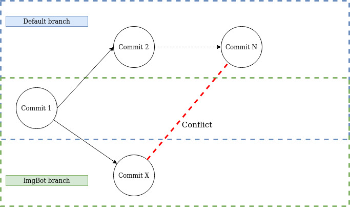
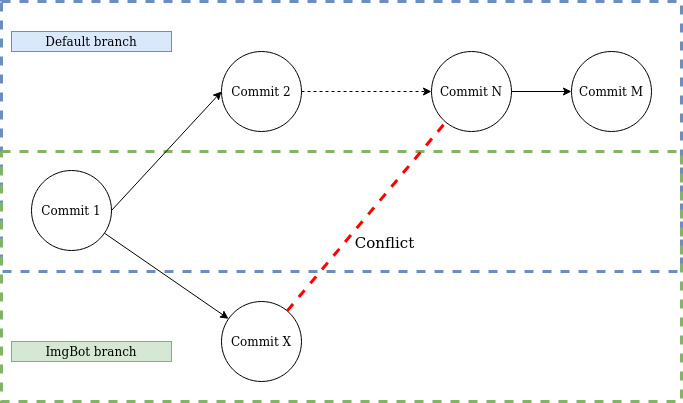
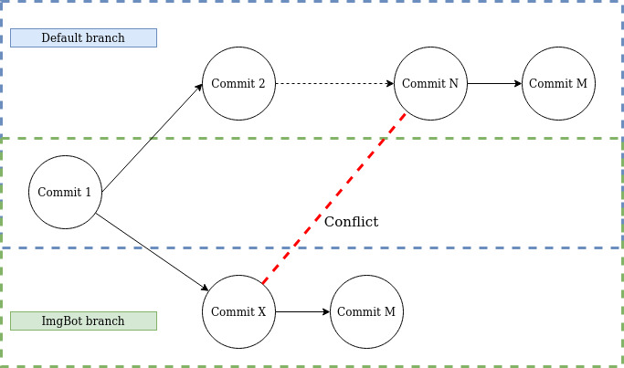
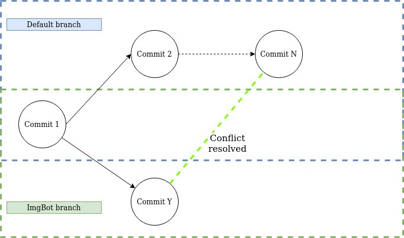

# OpenSource Contribution: ImgBot rebase feature
 
## Project Description:
 
ImgBot is a GitHub App that automates the compression of images in repositories. It is developed as a bot that scans over all the images in the repository and makes pull requests to the repository with the compressed images.
 
ImgBot is built as an Azure Functions app triggered by GitHub's webhooks. This means that the app is divided as a set of functions that are triggered via two different kinds of events: HTTP requests and message queues.
 
Our task consisted of implementing a rebase feature as described [here](https://github.com/dabutvin/Imgbot/issues/352)
 
Currently [our pull request](https://github.com/dabutvin/Imgbot/pull/635) is under review.
 
## Implementation
 
### Setting up a local development environment
 
The first thing we attempted was to run the bot's functions locally. This could be done by using the Azure CLI. Using it we were able to build each function and set up an Azure Storage account, that was also needed since some functions are triggered by message queues, and some information is stored in tables.
 
We created our own GitHub App to gather the webhook calls payloads, once we acquired the payloads, we could simulate the calls to our local instance of ImgBot via Postman.
 
We also needed to set up communication the other way around: from our ImgBot local instance to the target GitHub repository. This is done via Octokit, a C# GitHub API wrapper, already used by ImgBot. We only had to provide the authentication token in order for it to be able to perform changes to the repository on the app's behalf.
 
With these steps done, we could now start modifying ImgBot's code and implement the new feature.
 
### @imgbot rebase.

The problem to solve is to automate a pull request rebase. Given that the automatically created ImgBot pull request can conflict with the current state of the default branch (usually master) of the target repository. This can happen when images are updated on the default branch. At this point, a user may request ImgBot to perform said rebase by commenting "@imgbot rebase" on the conflicting pull request. In order for us to listen to pull request comments, we had to subscribe to the [issue_comment](https://developer.github.com/v3/activity/events/types/#issuecommentevent) webhook, and after receiving the payload check that the comment had the correct format and is referring to an actual ImgBot branch. After the checks were performed the actual rebase was started.

### Diff. Compress. Commit. Cherry-pick. Rebase. Squash. Push.

We had set up the goal of making the feature as efficient as possible, this meant skipping the obvious solution of deleting the 'imgbot' branch and compressing every image again. To achieve this goal, we created a workflow describes as follows:
 
Conflicting state:

 
A comparison between the tip default branch (Commit N) and the tip of the ImgBot branch (Commit X) is made and the conflicting files are recompressed. A new commit with those new files is created (Commit M):

 
Commit M is then cherry-picked into the ImgBot branch and removed from the default branch:

 
Commit Y is created by squashing Commit X and M together, leaving the ImgBot branch with a single commit that does not conflict with the default branch:

 
This way the amount of re-compressed images was reduced to just the amount needed, by performing some git manipulation operations using LibGit2Sharp, a C# library to manipulate git repositories.
 
The resulting commit is modified to have an updated message with the new compression information.
 
Then the 'imgbot' branch was force pushed to the repository, and the PR modified to reflect the new compression values.
 
## Challenges
 
During the development of these features, we came into several challenges, mainly because of our inexperience with GitHub Apps and Azure Functions.
 
### Subtlety: GitHub webhooks carry additional information for GitHub Apps
At first, we could not get all the required values in the payload because we were trying to simulate the calls using the normal Github webhooks. The documentation was not too clear about where to get values such as [InstallationId](https://developer.github.com/apps/quickstart-guides/setting-up-your-development-environment/#authenticating-as-an-installation) that are only appended to the payload if the webhook is called for a GitHub App, which makes perfect sense.
 
### Azure Functions app
Setting up the Azure Functions app is not straightforward, luckily ImgBot provides great documentation on [how to do it](https://imgbot.net/docs/#contributing).
 
### LibGit2Sharp
A lot of LibGit2Sharp's functionality is not documented. We had to directly explore code in the [repository](https://github.com/libgit2/libgit2sharp) in order to figure out which functions we were supposed to use.
 
## Conclusion
 
Working in this project has given us some experience in fields in which we didn't have much, such as FaaS, bots, GitHub advanced features, and exposition to environments that were not the norm for us, specifically to Microsoft Azure and C#.
 
As always, the experience of contributing to open-source projects and a bigger effort and providing our effort to the open-source community is highly gratifying.

