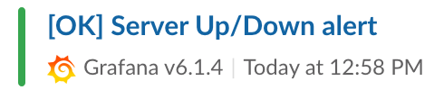

# Docker Swarm with logging and monitoring.

* Group members: Jakob Holm (jakobhol@kth.se) & Adibbin Haider (adibbin@kth.se)

This stack utilises the ELK-stack for logging and Grafana + Prometheus for monitoring.

### Prerequisites
* [Docker](https://www.docker.com/)

# Steps to test locally
Make sure that docker is running on your machine.
1. Start the stack with: 
```bash
$ docker-compose build && docker-compose up
```
2. Check that everything up and running:
* [Prometheus uses port 9090](http://localhost:9090) 
* [Grafana uses port 3000](http://localhost:3000)
* [Kibana uses port 5601](http://localhost:5601/)
* [Backend uses port 4004](http://localhost:4004/health)

3. Add dashboard to grafana:
```bash
curl -XPOST -i -u admin:admin  http://localhost:3000/api/dashboards/db --data-binary @./grafana/dashboards/dashboard.json -H "Content-Type: application/json"
```
N.B. This dashboard is extremely barebones, we could have spent more time configuring this of course, but that task is left to the reader as the looks of dashboards will vary between use cases and personal preferences. The good thing with Grafana is that it is very customisable. And the metrics that can be added as to the Dashboard will also vary between applications. The metrics that are avaiable with this stack (NodeJS) can be seen [here](http://localhost:4004/metrics) (assuming the stack is up and running locally).

4. Check that logs in kibana is working properly:

Visit the local [Kibana instance](http://localhost:5601/), it should look like the image below:


Press `Create` and then press `Discover`. Now ut should look like this if everything is working: 


5. Check that dashboard has been added to Grafana:

If it is the first time logging in to Grafana, the username and password will both be `admin`. Log in and the following page should be visible:


Press KTH DevOps Dashboard:


Should need arise, add more views.

6. Test backend endpoints:

The available endpoints are: 
| Verb |Route     |Description        |
|------|----------|-------------------|
| GET  | `/health`| Health check route|
| GET  | `/crash` |Crashes the backend|

If you decide to crash the backend, it can easily be restarted with the following command:
```bash
$ docker-compose restart backend
```
# Deploying this stack

Make sure that you are on a swarm manager node and then deploy it with 
```bash
$ docker stack deploy -c open-stack.yml open-stack
```
To verify the deploy, follow the steps above but note that the services wont be available on the same adresses. 

# Grafana Alert Notifications
When Grafana alerts changes status, it sends out notifcations. Each alert can have mulitplice notifications. Grafana have support to send out alert notifications using Email, Slack, PagerDuty, Kafka, Google Hangouts Chats and more. 

## Grafana Slack alert notifcation
To set up slack you need to configure an incoming webhook url at slack. You can follow their guide on how to do that [here](https://api.slack.com/incoming-webhooks). 

### Connect Slack with Grafana using your webhook
1. Go to `Alerting` page, then choose  `Notifcation Channels` tab.
2. Press `Add Channel`
3. Set a name for for your new notifcation channel.
4. Choose `Slack` under `Type`
5. Enable `Send on all alerts`
6. Add your generated incoming webhook you just previous created under `URL`
7. Press save.

Now should Grafana be configured to send alerts to your designated Slack channel or user you configured on your webhook.

You can test it by pressing `Send Test`. 

### Test notification


#### Testing the Slack Integration locally
After setting up the Slack integration, test it with theese following instructions:

1. Make sure the stack is running.
2. Crash the backend using the [crash endpoint.](http://localhost:4004/crash)
3. Wait until Grafana starts to alert.
4. Go to your Slack to make sure you have recieved an alert. It should look like this:

5. Restart the backend using `$ docker-compose restart backend`
6. Wait until Grafana stops alerting
7. Go to your Slack to make sure you have recieved a second alert. It should look like this:



