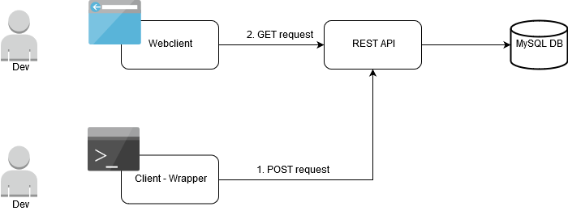

# Lightweight build scan tool
## Group members
- Johan Luttu, luttu@kth.se
- Oscar Rosquist, oscarros@kth.se
## Description
We want to create a lightweight build scan tool/build wrapper that captures the data about your builds and creates a link to a report about the build that can be displayed on a website. This can be useful if one is having problems with a build and want to request help from a colleague. The build scan link can then be easily shared which allows the colleague to quickly see everything about the build that's relevant, such as the build command, stack trace/output, environment, dependencies, etc.

We're inspired by the [build scans](https://gradle.com/build-scans/) that Gradle enterprise supports and we intend to create something similar that's not only limited to gradle. Instead, our build wrapper will be very simple and limited to gcc at first. It'll capture the command, environment variables and the gcc output. It will also serve as a logging tool which logs how long each build takes and how many that succeed. This can provide valuable insights. Every build scan will be pushed to a Node.js web server. We'll use Vue as the front-end and MySQL as a database.

## Submission URL

URL to our repository for the project: https://github.com/jqhan/bscan
