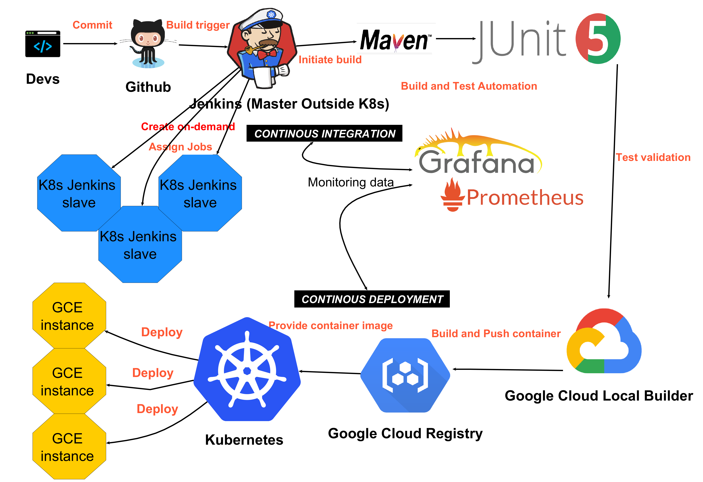

##Course task proposal form
Opentask: CI, CD pipeline design with Kubernetes

Members: Henry Luong and Saha parumita

Task: We want to try setting up a pipeline using Jenkins(CI with Maven and Junit), Prometheus&Grafana(Monitoring), Google cloud builder plugin & Google cloud registry(build and push containers) and Kubernetes(Orchestration). 

IMPORTANT!! 
 * Our application for deployment and instruction for setting up the pipeline is in this [repo](https://github.com/Tailp/CI) 
 * Youtube link to see our pipeline in action [Youtubelink](https://www.youtube.com/watch?v=kEL1E0Bih_0&feature=youtu.beO) 
 * Tutorial videos [Tutorial 1](https://www.youtube.com/watch?v=LeLxMfYsqa8&t=116s) [Tutorial 2](https://www.youtube.com/watch?v=XswaeGfCBvw&t=171s). For more details what they are about please check out our [repo](https://github.com/Tailp/CI)

## Description & idea presentation
Our idea is to create a Jenkins CI/CD pipeline with the aim of minimizing the budget cost of deploying to Kubernetes. While there are many guides and good information out there on the internet about setting up a Jenkins master inside the cluster together with slave virtual machine, there is still very little and also fragmented information about the setup of CI/CD pipeline for smooth deployments from Jenkins outside the cluster.

While it's easy and well supported by Google to set up Jenkins inside the cluster on first sight, the cost of maintaining the cluster hosting the pipeline is not a small sum for companies like small start-ups or personal project, not to mention that your pipeline is deployed under the premise of immutability of pods, which means there are certain risks like for instance the configuration might be gone or some parts of it are missing due to K8s update or deletes of pods(either manually or out of budget on Google account) which in turn might induce some hard-to-crack bugs or in worst case re-setting up the entire pipeline. I do admit there are some workaround when it comes to retaining the pods' configuration, but do keep in mind that these work-around violate the fundamental concept of pods. Therefore the safest choice is to keep the entire pipeline running all the time and this creates another problem which is money since Google tax cost per minute per GCE instance running.

In summary we want something for a pipeline which is decently functional but low cost and little dependency of K8s when deploying and our approach to this is to set up the Jenkins master outside for jobs executions, while the Jenkins slave virtual machines(GCE instances), are created only when it's demanded from the Master Jenkins. The slaves function just like a normal Jenkins slave and will automatically be removed after a period of inactivities. This way both the costs and risks for the pipeline will be minimized, also this might also be an attractive solution for those who already have Jenkins outside the cluster since a pipeline migration into the cluster might be quite painful.

